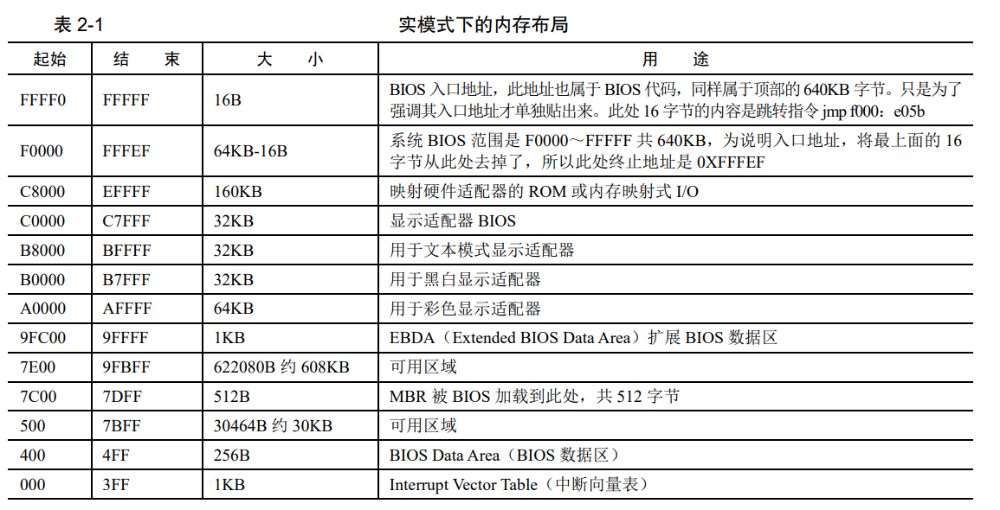
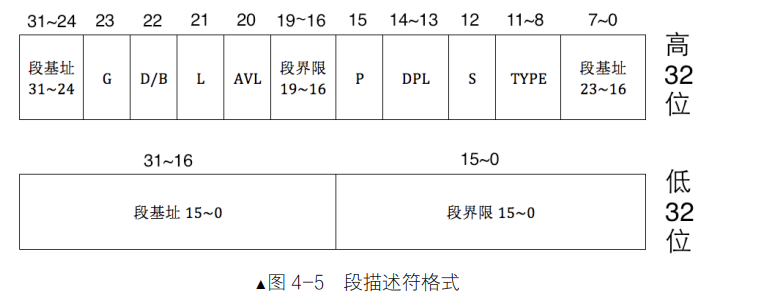
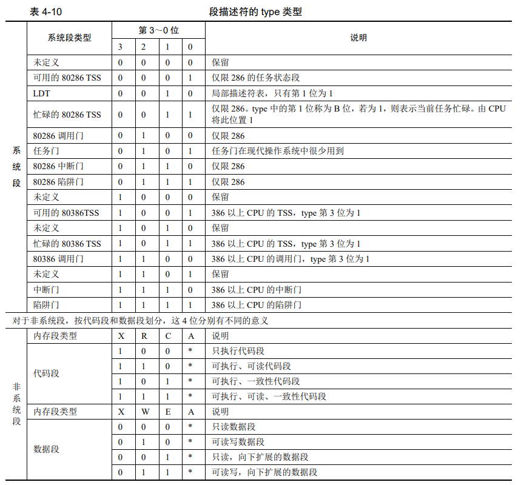

### 第二章 编写MBR

## bios

计算机的启动：系统上电加载cs：ip 寄存器被强制初始化为 0xF000：0xFFF0 ->rom上的固化bios->硬件自检->加载到物理地址 0x7c00   进入mbr->mbr把磁盘扇区2的loader读取到内存中去，跳转到loader->

bios的内存布局



在系统上电时，CPU 的 cs：ip 寄存器被强制初始化为 0xF000：0xFFF0，也就是bios的入口地址。地址0xF000：0xFFF0的指令为-->jmp far f000：e05b，开始检测硬件信息，自检，最后一项任务是检验启动盘中0盘0道1扇区的内容。如果此扇区末尾的两个字节分别是魔数 0x55 和 0xaa，BIOS 便认为此扇区中确实存在可执行的程序，便加载到物理地址 0x7c00，执行mbr

## mbr

mbr的初始功能，清屏bios信息，打印一句话，证明bios已经将权限转交给mbr

```
SECTION MBR vstart=0x7c00 ;起始地址编译在0x7c00
    mov ax,cs
    mov ds,ax
    mov es,ax
    mov ss,ax
    mov fs,ax
    mov sp,0x7c00
    ;这个时候 ds = es = ss = 0 栈指针指向MBR开始位置


    ;ah = 0x06 al = 0x00 想要调用int 0x06的BIOS提供的中断对应的函数 即向上移动即完成清屏功能
    ;cx dx 分别存储左上角与右下角的左边 详情看int 0x06函数调用
    mov ax,0x600 
    mov bx,0x700
    mov cx,0
    mov dx,0x184f

    ;调用BIOS中断
    int 0x10 

    mov ah,3
    mov bh,0

    ;获取光标位置 需要打印信息
    int 0x10

    mov ax,message
    mov bp,ax

    mov cx,9
    mov ax,0x1301

    mov bx,0x71;

    int 0x10 ;写字符串

    jmp $ ;无限循环 一直跳转到当前命令位置

    ;字符串声明 db == define byte dw == define word ascii一个字符占一个字节
    message db "MBR init!" 

    ;预留两个字节 其余空余的全部用0填满 为使检测当前扇区最后两字节为0x55 0xaa 检测是否为有效扇区
    ;510 = 512字节-2预留字节  再减去（当前位置偏移量-段开始位置偏移量）求出来的是剩余空间
    times 510 - ($ - $$) db 0 
    db 0x55,0xaa
```

### 第三章 完善mbr

    mbr需要读取硬盘扇区2的lodaer信息，并加载到内存中，然后跳转到内存对应的区域去启动loader

mbr:

```
%include "boot.inc"
SECTION MBR vstart=0x7c00 ;起始地址编译在0x7c00
    mov ax,cs
    mov ds,ax
    mov es,ax
    mov ss,ax
    mov fs,ax
    mov sp,0x7c00
    mov ax,0xb800 ; ax为文本信号起始区
    mov gs,ax     ; gs = ax 充当段基址的作用


    ;ah = 0x06 al = 0x00 想要调用int 0x06的BIOS提供的中断对应的函数 即向上移动即完成清屏功能
    ;cx dx 分别存储左上角与右下角的左边 详情看int 0x06函数调用
    mov ax,0x600 
    mov bx,0x700
    mov cx,0
    mov dx,0x184f

    ;调用BIOS中断
    int 0x10 

    mov byte [gs:0x00],'K' ;低位字节储存ascii字符 小端储存内存顺序相反
    mov byte [gs:0x01],0xA4    ;背景储存在第二个字节 含字符与背景属性

    mov byte [gs:0x02],'A' 
    mov byte [gs:0x03],0xA4

    mov byte [gs:0x04],'Y' 
    mov byte [gs:0x05],0xA4

    mov byte [gs:0x06],'L' 
    mov byte [gs:0x07],0xA4

    mov byte [gs:0x08],'E' 
    mov byte [gs:0x09],0xA4

    mov byte [gs:0x0A],' ' 
    mov byte [gs:0x0B],0xA4

    mov byte [gs:0x0C],'O' 
    mov byte [gs:0x0D],0xA4

    mov byte [gs:0x0E],'S' 
    mov byte [gs:0x0F],0xA4

    mov eax,LOADER_START_SECTOR    

    mov bx,LOADER_BASE_ADDR ;把要目标内存位置放进去 bx常作地址储存

    mov cx,1;读取磁盘数 cx常作计数

    call rd_disk_m_16

    jmp LOADER_BASE_ADDR ; 
;------------------------------------------------------------------------
;读取第二块硬盘
rd_disk_m_16:
;------------------------------------------------------------------------
;1 写入待操作磁盘数
;2 写入LBA 低24位寄存器 确认扇区
;3 device 寄存器 第4位主次盘 第6位LBA模式 改为1
;4 command 写指令
;5 读取status状态寄存器 判断是否完成工作
;6 完成工作 取出数据

 ;;;;;;;;;;;;;;;;;;;;;
 ;1 写入待操作磁盘数
 ;;;;;;;;;;;;;;;;;;;;;
    mov esi,eax   
    mov di,cx    

    mov dx,0x1F2  
    mov al,cl     
    out dx,al    

    mov eax,esi   ; 

;;;;;;;;;;;;;;;;;;;;;
;2 写入LBA 24位寄存器 确认扇区
;;;;;;;;;;;;;;;;;;;;;
    mov cl,0x8    ; shr 右移8位 把24位给送到 LBA low mid high 寄存器中

    mov dx,0x1F3  ; LBA low
    out dx,al 

    mov dx,0x1F4  ; LBA mid
    shr eax,cl    ; eax为32位 ax为16位 eax的低位字节 右移8位即8~15
    out dx,al

    mov dx,0x1F5
    shr eax,cl
    out dx,al

;;;;;;;;;;;;;;;;;;;;;
;3 device 寄存器 第4位主次盘 第6位LBA模式 改为1
;;;;;;;;;;;;;;;;;;;;;   
    shr eax,cl

    and al,0x0f 
    or al,0xe0   ;!!! 把第四-七位设置成0111 转换为LBA模式
    mov dx,0x1F6 ; 参照硬盘控制器端口表 Device 
    out dx,al

;;;;;;;;;;;;;;;;;;;;;
;4 向Command写操作 Status和Command一个寄存器
;;;;;;;;;;;;;;;;;;;;;

    mov dx,0x1F7 ; Status寄存器端口号
    mov ax,0x20  ; 0x20是读命令
    out dx,al

;;;;;;;;;;;;;;;;;;;;;
;5 向Status查看是否准备好
;;;;;;;;;;;;;;;;;;;;;

           ;设置不断读取重复 如果不为1则一直循环
  .not_ready:     
    nop           ; !!! 空跳转指令 在循环中达到延时目的
    in al,dx      ; 把寄存器中的信息返还出来
    and al,0x88   ; !!! 0100 0100 0x88
    cmp al,0x08
    jne .not_ready ; !!! jump not equal == 0

;;;;;;;;;;;;;;;;;;;;;
;6 读取数据
;;;;;;;;;;;;;;;;;;;;;

    mov ax,di      ;把 di 储存的cx 取出来
    mov dx,256
    mul dx        ;与di 与 ax 做乘法 计算一共需要读多少次 方便作循环 低16位放ax 高16位放dx
    mov cx,ax      ;loop 与 cx相匹配 cx-- 当cx == 0即跳出循环
    mov dx,0x1F0
 .go_read_loop:
    in ax,dx      ;两字节dx 一次读两字
    mov [bx],ax
    add bx,2
    loop .go_read_loop

    ret ;与call 配对返回原来的位置 跳转到call下一条指令
    ;预留两个字节 其余空余的全部用0填满 为使检测当前扇区最后两字节为0x55 0xaa 检测是否为有效扇区
    ;510 = 512字节-2预留字节  再减去（当前位置偏移量-段开始位置偏移量）求出来的是剩余空间
    times 510 - ($ - $$) db 0 
    db 0x55,0xaa
```

loader:

loader暂时只做打印，用于观察mbr是否成功跳转到loader

```
%include "boot.inc"
SECTION MBR vstart=LOADER_BASE_ADDR
    mov byte [gs:0x00],'2'
    mov byte [gs:0x01],0xA4    

    mov byte [gs:0x02],'' 
    mov byte [gs:0x03],0xA4

    mov byte [gs:0x04],'L' 
    mov byte [gs:0x05],0xA4

    mov byte [gs:0x06],'O' 
    mov byte [gs:0x07],0xA4

    mov byte [gs:0x08],'A' 
    mov byte [gs:0x09],0xA4

    mov byte [gs:0x0A],'D' 
    mov byte [gs:0x0B],0xA4

    mov byte [gs:0x0C],'E' 
    mov byte [gs:0x0D],0xA4

    mov byte [gs:0x0E],'R' 
    mov byte [gs:0x0F],0xA4

    jmp $
```

### 第四章 保护模式入门

    32位cpu支持保护模式和实模式。在保护模式中除了段寄存器都被扩展到了32位。

    段基址的提供：存在一个全局描述符表，每一个表项是段描述符，64字节描述内存段的起始地址，大小，权限，全局描述符是放在内存中的。

    在使用16位时，使用[bits 16]标识，32位使用[bits 32]标识。

    段描述符结构：

    1.S位决定是系统段（硬件：各种门）还是非系统段（软件），s为0表示系统段，s为1表示数据段

    2.    type用于表示门的子类型（当s为0）或者非系统段的类型（当s为1，例如数据段或代码段等）

    3.DPL是描述符特权级，数字越小特权越大

    4.P表示段是否存在与内存中

    5.G是用来指定段界限的单位大小（1字节和4kb可选）





## 全局描述符表GDT 局部描述表LDT和选择子

    全局描述符表位于内存中，需要GDTR寄存器指向他，CPU才能直到他在哪里，GDTR是一个48位寄存器


    段选择子：由于段基址保存在了段描述符里，所以段寄存器

    进入保护模式的步骤：

    1.打开A20   

    2.加载gdt

    3.将cr0的pe位置1
