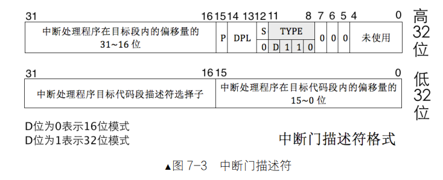

# 第二章 编写MBR

## bios

计算机的启动：系统上电加载cs：ip 寄存器被强制初始化为 0xF000：0xFFF0 ->rom上的固化bios->硬件自检->加载到物理地址 0x7c00   进入mbr->mbr把磁盘扇区2的loader读取到内存中去，跳转到loader->loader将内核复制到内存->内核

bios的内存布局


在系统上电时，CPU 的 cs：ip 寄存器被强制初始化为 0xF000：0xFFF0，也就是bios的入口地址。地址0xF000：0xFFF0的指令为-->jmp far f000：e05b，开始检测硬件信息，自检，最后一项任务是检验启动盘中0盘0道1扇区的内容。如果此扇区末尾的两个字节分别是魔数 0x55 和 0xaa，BIOS 便认为此扇区中确实存在可执行的程序，便加载到物理地址 0x7c00，执行mbr

## mbr

mbr的初始功能，清屏bios信息，打印一句话，证明bios已经将权限转交给mbr

```
SECTION MBR vstart=0x7c00 ;起始地址编译在0x7c00
    mov ax,cs
    mov ds,ax
    mov es,ax
    mov ss,ax
    mov fs,ax
    mov sp,0x7c00
    ;这个时候 ds = es = ss = 0 栈指针指向MBR开始位置


    ;ah = 0x06 al = 0x00 想要调用int 0x06的BIOS提供的中断对应的函数 即向上移动即完成清屏功能
    ;cx dx 分别存储左上角与右下角的左边 详情看int 0x06函数调用
    mov ax,0x600 
    mov bx,0x700
    mov cx,0
    mov dx,0x184f

    ;调用BIOS中断
    int 0x10 

    mov ah,3
    mov bh,0

    ;获取光标位置 需要打印信息
    int 0x10

    mov ax,message
    mov bp,ax

    mov cx,9
    mov ax,0x1301

    mov bx,0x71;

    int 0x10 ;写字符串

    jmp $ ;无限循环 一直跳转到当前命令位置

    ;字符串声明 db == define byte dw == define word ascii一个字符占一个字节
    message db "MBR init!" 

    ;预留两个字节 其余空余的全部用0填满 为使检测当前扇区最后两字节为0x55 0xaa 检测是否为有效扇区
    ;510 = 512字节-2预留字节  再减去（当前位置偏移量-段开始位置偏移量）求出来的是剩余空间
    times 510 - ($ - $$) db 0 
    db 0x55,0xaa
```

# 第三章 完善mbr

    mbr需要读取硬盘扇区2的lodaer信息，并加载到内存中，然后跳转到内存对应的区域去启动loader

mbr:

```
%include "boot.inc"
SECTION MBR vstart=0x7c00 ;起始地址编译在0x7c00
    mov ax,cs
    mov ds,ax
    mov es,ax
    mov ss,ax
    mov fs,ax
    mov sp,0x7c00
    mov ax,0xb800 ; ax为文本信号起始区
    mov gs,ax     ; gs = ax 充当段基址的作用


    ;ah = 0x06 al = 0x00 想要调用int 0x06的BIOS提供的中断对应的函数 即向上移动即完成清屏功能
    ;cx dx 分别存储左上角与右下角的左边 详情看int 0x06函数调用
    mov ax,0x600 
    mov bx,0x700
    mov cx,0
    mov dx,0x184f

    ;调用BIOS中断
    int 0x10 

    mov byte [gs:0x00],'K' ;低位字节储存ascii字符 小端储存内存顺序相反
    mov byte [gs:0x01],0xA4    ;背景储存在第二个字节 含字符与背景属性

    mov byte [gs:0x02],'A' 
    mov byte [gs:0x03],0xA4

    mov byte [gs:0x04],'Y' 
    mov byte [gs:0x05],0xA4

    mov byte [gs:0x06],'L' 
    mov byte [gs:0x07],0xA4

    mov byte [gs:0x08],'E' 
    mov byte [gs:0x09],0xA4

    mov byte [gs:0x0A],' ' 
    mov byte [gs:0x0B],0xA4

    mov byte [gs:0x0C],'O' 
    mov byte [gs:0x0D],0xA4

    mov byte [gs:0x0E],'S' 
    mov byte [gs:0x0F],0xA4

    mov eax,LOADER_START_SECTOR    

    mov bx,LOADER_BASE_ADDR ;把要目标内存位置放进去 bx常作地址储存

    mov cx,1;读取磁盘数 cx常作计数

    call rd_disk_m_16

    jmp LOADER_BASE_ADDR ; 
;------------------------------------------------------------------------
;读取第二块硬盘
rd_disk_m_16:
;------------------------------------------------------------------------
;1 写入待操作磁盘数
;2 写入LBA 低24位寄存器 确认扇区
;3 device 寄存器 第4位主次盘 第6位LBA模式 改为1
;4 command 写指令
;5 读取status状态寄存器 判断是否完成工作
;6 完成工作 取出数据

 ;;;;;;;;;;;;;;;;;;;;;
 ;1 写入待操作磁盘数
 ;;;;;;;;;;;;;;;;;;;;;
    mov esi,eax   
    mov di,cx    

    mov dx,0x1F2  
    mov al,cl     
    out dx,al    

    mov eax,esi   ; 

;;;;;;;;;;;;;;;;;;;;;
;2 写入LBA 24位寄存器 确认扇区
;;;;;;;;;;;;;;;;;;;;;
    mov cl,0x8    ; shr 右移8位 把24位给送到 LBA low mid high 寄存器中

    mov dx,0x1F3  ; LBA low
    out dx,al 

    mov dx,0x1F4  ; LBA mid
    shr eax,cl    ; eax为32位 ax为16位 eax的低位字节 右移8位即8~15
    out dx,al

    mov dx,0x1F5
    shr eax,cl
    out dx,al

;;;;;;;;;;;;;;;;;;;;;
;3 device 寄存器 第4位主次盘 第6位LBA模式 改为1
;;;;;;;;;;;;;;;;;;;;;   
    shr eax,cl

    and al,0x0f 
    or al,0xe0   ;!!! 把第四-七位设置成0111 转换为LBA模式
    mov dx,0x1F6 ; 参照硬盘控制器端口表 Device 
    out dx,al

;;;;;;;;;;;;;;;;;;;;;
;4 向Command写操作 Status和Command一个寄存器
;;;;;;;;;;;;;;;;;;;;;

    mov dx,0x1F7 ; Status寄存器端口号
    mov ax,0x20  ; 0x20是读命令
    out dx,al

;;;;;;;;;;;;;;;;;;;;;
;5 向Status查看是否准备好
;;;;;;;;;;;;;;;;;;;;;

           ;设置不断读取重复 如果不为1则一直循环
  .not_ready:     
    nop           ; !!! 空跳转指令 在循环中达到延时目的
    in al,dx      ; 把寄存器中的信息返还出来
    and al,0x88   ; !!! 0100 0100 0x88
    cmp al,0x08
    jne .not_ready ; !!! jump not equal == 0

;;;;;;;;;;;;;;;;;;;;;
;6 读取数据
;;;;;;;;;;;;;;;;;;;;;

    mov ax,di      ;把 di 储存的cx 取出来
    mov dx,256
    mul dx        ;与di 与 ax 做乘法 计算一共需要读多少次 方便作循环 低16位放ax 高16位放dx
    mov cx,ax      ;loop 与 cx相匹配 cx-- 当cx == 0即跳出循环
    mov dx,0x1F0
 .go_read_loop:
    in ax,dx      ;两字节dx 一次读两字
    mov [bx],ax
    add bx,2
    loop .go_read_loop

    ret ;与call 配对返回原来的位置 跳转到call下一条指令
    ;预留两个字节 其余空余的全部用0填满 为使检测当前扇区最后两字节为0x55 0xaa 检测是否为有效扇区
    ;510 = 512字节-2预留字节  再减去（当前位置偏移量-段开始位置偏移量）求出来的是剩余空间
    times 510 - ($ - $$) db 0 
    db 0x55,0xaa
```

loader:

loader暂时只做打印，用于观察mbr是否成功跳转到loader

```
%include "boot.inc"
SECTION MBR vstart=LOADER_BASE_ADDR
    mov byte [gs:0x00],'2'
    mov byte [gs:0x01],0xA4    

    mov byte [gs:0x02],'' 
    mov byte [gs:0x03],0xA4

    mov byte [gs:0x04],'L' 
    mov byte [gs:0x05],0xA4

    mov byte [gs:0x06],'O' 
    mov byte [gs:0x07],0xA4

    mov byte [gs:0x08],'A' 
    mov byte [gs:0x09],0xA4

    mov byte [gs:0x0A],'D' 
    mov byte [gs:0x0B],0xA4

    mov byte [gs:0x0C],'E' 
    mov byte [gs:0x0D],0xA4

    mov byte [gs:0x0E],'R' 
    mov byte [gs:0x0F],0xA4

    jmp $
```

# 第四章 保护模式入门

    32位cpu支持保护模式和实模式。在保护模式中除了段寄存器都被扩展到了32位。

    段基址的提供：存在一个全局描述符表，每一个表项是段描述符，64字节描述内存段的起始地址，大小，权限，全局描述符是放在内存中的。

    在使用16位时，使用[bits 16]标识，32位使用[bits 32]标识。

    段描述符结构：

    1.S位决定是系统段（硬件：各种门）还是非系统段（软件），s为0表示系统段，s为1表示数据段

    2.    type用于表示门的子类型（当s为0）或者非系统段的类型（当s为1，例如数据段或代码段等）

    3.DPL是描述符特权级，数字越小特权越大

    4.P表示段是否存在与内存中

    5.G是用来指定段界限的单位大小（1字节和4kb可选）


## 全局描述符表GDT 局部描述表LDT和选择子

    全局描述符表位于内存中，需要GDTR寄存器指向他，CPU才能知道他在哪里，GDTR是一个48位寄存器


    加载GDTR的指令：lgdt（本质上是告诉cpu，GDT在哪里？）

    段选择子：由于段基址保存在了段描述符里，所以段寄存器不需要是32位的。段寄存器是16位，低2位是RPL，第二位是TI，用来指示选择子在GDT还是LDT中索引，剩下的是索引值


    A20：是否打开这根地址线决定了当访问超过20位的地址会不会绕回，这也决定了实模式/保护模式的地址方式，打开A20地址线的方法，将端口0x92的第一位置1

    进入保护模式的步骤：

    1.打开A20   

    2.加载gdt

    3.将cr0的pe位置1

```
%include "boot.inc"
SECTION loader vstart=LOADER_BASE_ADDR
LOADER_STACK_TOP equ LOADER_BASE_ADDR            ;是个程序都需要有栈区 我设置的0x600以下的区域到0x500区域都是可用空间 况且也用不到
jmp loader_start                                 ;下面存放数据段 构建gdt 跳跃到下面的代码区

                                  ;对汇编再复习 db define byte,dw define word,dd define dword
    GDT_BASE        : dd 0x00000000                     ;刚开始的段选择子0不能使用 故用两个双字 来填充
                  dd 0x00000000 

    CODE_DESC       : dd 0x0000FFFF                    ;FFFF是与其他的几部分相连接 形成0XFFFFF段界限
                   dd DESC_CODE_HIGH4

    DATA_STACK_DESC : dd 0x0000FFFF
                 dd DESC_DATA_HIGH4

    VIDEO_DESC      : dd 0x80000007                    ;0xB8000 到0xBFFFF为文字模式显示内存 B只能在boot.inc中出现定义了 此处不够空间了 8000刚好够
                        dd DESC_VIDEO_HIGH4            ;0x0007 (bFFFF-b8000)/4k = 0x7

    GDT_SIZE              equ $ - GDT_BASE               ;当前位置减去GDT_BASE的地址 等于GDT的大小
    GDT_LIMIT              equ GDT_SIZE - 1                  ;SIZE - 1即为最大偏移量

    times 60 dq 0                                    ;预留60个 四字型 描述符
    SELECTOR_CODE        equ (0X0001<<3) + TI_GDT + RPL0    ;16位寄存器 4位TI RPL状态 GDT剩下的选择子
    SELECTOR_DATA      equ (0X0002<<3) + TI_GDT + RPL0
    SELECTOR_VIDEO       equ (0X0003<<3) + TI_GDT + RPL0

    ;gdt指针 2字gdt界限放在前面 4字gdt地址放在后面 lgdt 48位格式 低位16位界限 高位32位起始地址
    gdt_ptr           dw GDT_LIMIT
                   dd GDT_BASE

    loadermsg db   'welcome to loader zone!'                  ;loadermsg 加载区显示字符

loader_start:

    mov sp,LOADER_BASE_ADDR                    ;这里疑惑了我许久 es我们没有初始化 值究竟是多 为什么等于cs
    mov bp,loadermsg                                          ;es:bp 字符串地址 ah 功能号 bh 页码 bl 属性 cx 字符串长度 
    mov cx,22     
    mov ax,cs                                                 ;于是我还是向把es给初始化了一下 保证心里面有底
    mov es,ax                                                 ;通过ax 赋值给es
    mov ax,0x1301                                             ;ah = 13 al = 0x1
    mov bx,0x001f                                             ;页码属性 可以不管
    mov dx,0x1800                                             ;dh = 0x18 == 24 意思是最后一行 0列开始
    int 0x10

; --------------------------------- 设置进入保护模式 -----------------------------
; 1 打开A20 gate
; 2 加载gdt
; 3 将cr0 的 pe位置1

    in al,0x92                 ;端口号0x92 中 第1位变成1即可
    or al,0000_0010b
    out 0x92,al

    lgdt [gdt_ptr] 

    mov eax,cr0                ;cr0寄存器第0位设置位1
    or  eax,0x00000001              
    mov cr0,eax

;-------------------------------- 已经打开保护模式 ---------------------------------------
    jmp dword SELECTOR_CODE:p_mode_start                       ;刷新流水线

 [bits 32]
 p_mode_start: 
    mov ax,SELECTOR_DATA
    mov ds,ax
    mov es,ax
    mov ss,ax
    mov esp,LOADER_STACK_TOP
    mov ax,SELECTOR_VIDEO
    mov gs,ax

    mov byte [gs:160],'P'

    jmp $          
```

在loader中自己编译gdt，将起始地址和界限拼起来构成GDTR，在后面打开保护模式时lgdt [gdt_ptr]加载进去。这就说明GDTR寄存器和GDT都是不存在物理上的，而是逻辑上的，都需要手动去构建。


## 保护模之内存段的保护

### 向段寄存器加载选择子的保护

    1.段描述符要在全局描述符的界限之内：描述符表基地址+选择子中的索引值*8+7 <=描述符表基地址+描述符表界限值。

    2.检查要加载的段描述符的type字段和要被加载的寄存器属性是否一致

### 代码段和数据段的保护

    简而言之：数据段不能访问跨越当前段的数据，代码的指令也必须完全的保存在当前段中，不能一部分在当前段，一部分在另一段，否则会cpu会抛异常

# 向内核迈进

    分页机制：

    一级页表：页表是n行1列的表格，页表的每一项被称为页表项，页表项里存的是物理地址。在设计时，将32位地址分为高20位的页表项数量，和低12位的页表项大小（4k），也就是说页表项的布局是：由2的20次方个 大小为4k的页表项组成。页表项是存在于物理地址上的，在访问页表项不开启分页机制（要不就无限递归了）。在访问时：线性地址的高20位做为索引去页表项中找到对应的物理地址（数组下标访问：索引*4+页表项的起始物理地址），从页表项中拿到的物理地址再与线性地址的低12位相加，就是最终的物理地址。

    

    二级页表

    在一级页表之上加了一个页目录项去寻找页表，地址转换方式也有所改变，高10位×4+cr3得到页目录表中的页表的物理地址，中十位×4+页表物理地址得到真实的物理地址，低12位是偏移地址，偏移地址+真实物理地址就得到了最后的实际地址。


    页目录表和页表的最后一项用来记录页目录表/页表本身，用来找到自己：

    在开启分页机制后，我们想要构造页目录表/页表，此时即使知道页目标表/页表的物理地址，也不能用该地址操作，因为在分页机制下，送进来的线性地址都会被页表转换为物理地址，所以我们要想办法构造这个线性地址，使其能找到对应的页目录表/页表。

    解决方法：在页目录表/页表的最后一项中记录自己的地址，假如我们想构造页目录表中的内容，我们可以连续跳转两次页目录表的最后一项，用最后的偏移地址操作页目录表；想构造页表我们可以先从页目录表跳转到页表，再跳转到页表的最后一项，其实还是这个页表，再用偏移地址操作页表。


    页目录项和页表项的结构：由于标准页大小为4kb，所以地址的低12为都是0，可以不用保存，用来记录一些其他信息


    cr3寄存器：


    页目录项和页表在物理内存中的分配：


    虚拟内存和物理内存的映射：

    

    打开分页机制的步骤：

    1.准备好页目录表及页表。
    2.将页表地址写入控制寄存器 cr3。
    3.寄存器 cr0 的 PG 位置 1。
    页目录项和页表在内存中的安排：
    

### elf


loader的最终使命：加载内核，初始化内核。

# 中断

### 中断分类

    外部中断：外部中断分为可屏蔽中断（来自外设）和不可屏蔽中断（灾难性错误）


    内部中断：软中断和异常

        软中断：int 8位立即数

        异常：按照轻重程度，可分为：fault（例如：page fault），trap（调试），abort（终止）

## 中断描述表

    中断描述符表IDT，表中每个描述符被称为门。在实模式中中断向量表的位置是固定的，而中断描述符表的位置是不固定的，通过CPU的IDTR寄存器保存他的位置（和GDT相似）

    中断描述符：



    加载IDTR的指令：lidt 48位内存数据


中断发生后，eflags 中的 NT 位和 TF 位会被置 0。如果中断对应的门描述符是中断门，标志寄存器 eflags中的 IF 位被自动置 0，避免中断嵌套


在中断时，如果中断前后都是同一级也就是平级转移，只会压入中断前的状态寄存器、es，ip。如果中断前后不是同一级，发生了特权级低->高，还会额外压入中断前的ss和sp栈指针。


# 内存管理系统

## makefile

    makefile由目标文件，依赖文件，规则组成，如果依赖文件的修改时间比目标文件的修改时间新，则执行规则的命令

    自动化变量：

```
$@:当前规则的目标文件的集合
$^:当前规则的依赖文件的集合   
$<:当前规则的第一个依赖文件  
```

## 位图


    在管理内存时，我们需要知道哪些内存以及使用，哪些没有使用，我们使用占用内存最小的数据结构：位图，去记录内存的是否使用，位图中的每一位对应内存的4kb，这样1bit就能表示4kb的内存，就达到了记录内存使用情况的    需求。

位图的基本操作：

```c
置位：
   bitmap[index/8] |= (1<<index%8)
清除位：
   bitmap[index/8] &= ~(1<<index%8)
检查位：
   bitmap[index/8] & (1<<index%8)
```

## 内存管理

    将内核的第1mb和页目录表和页表除外的地址，分成两份，分别给内核和用户分配物理地址。

    内存池在物理地址中的布局：


    内核虚拟内存池的规划：


        位图的存放：


# 线程

    线程与进程的区别：进程拥有至少一个线程和资源，线程是要生存在进程当中的，一个线程就是一个执行流（为什么要分进程和线程：如果是在一个进程只有一个执行流的情况下，进程是和线程对等的，但是如果一个进程要创建多个线程（在一个程序中多个thread），这个时候就是一个进程拥有多个线程）

    线程提速：

    1.进程可以利用创建多个线程来提速：假如只有两个进程A,B，假设每个进程的时间片相同，那么单位时间内他俩执行的比例为1：1，此时进程A为了提速可以在进程A中创建n个线程去让调度器执行，那么此时AB的执行比例就是n：1。

    2.进程中如果有要阻塞等待的事件，可以创建一个线程去等待，避免阻塞整个进程。

### PCB

    每个进程维护一个PCB，进程表维护所有进程的PCB


## 第十章 输入输出系统

     使用键盘进行输入时，需要注册keyboard中断，keyboard的驱动程序需要自己写，键盘输入分为通码和断码（按下和松开）

    shell命令是由多个字符组成的，需要环形缓冲区把已键入的信息存储起来,环形缓冲区的结构如下：

```
struct ioqueue
{
    struct lock lock;
    //这把锁用来睡眠当缓冲区满了生产者仍然要生产和当缓冲区空了消费者仍然要消费的情况
    struct task_struct* producer;

    struct task_struct* consumer;

    char buf[bufsize];//缓冲区

    int32_t head; // 队首,数据往队首处写入
    int32_t tail; // 队尾,数据从队尾处读出

};
```

## 第十一章 用户进程

    TSS结构


    在cpu中使用TR寄存器来存储TSS的起始地址
